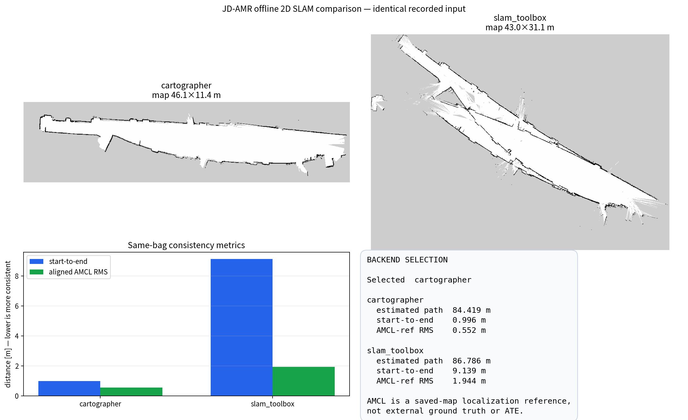

# JD-AMR SLAM 포트폴리오

실물 복도에서 저장 지도 기반 자율주행을 완주하고, 동일 센서 기록으로 2D SLAM 백엔드를
비교한 결과를 정리했다. 전체 요구사항과 수치 기준의 정본은
[SLAM 포트폴리오 PRD](.omx/plans/prd-jdamr-slam-portfolio.md)다.

## 현재 상태

`real_combined_obstacle_retry_20260910T122006`으로 저장 지도·Keepout·실시간 장애물 대응을
묶은 복도 왕복을 마쳤다. 20개 목표를 모두 통과했고 계획 경로는 77.290m, 기록된 AMCL
경로는 78.498m였다. Collision Monitor StopZone 6회와 같은 goal의 명령 재개를 확인했다.
LiDAR 객체 분류기는 없으므로 박스나 사람을 자동 분류했다고 주장하지 않는다.

### 2026-09-04 DDS 격리 기준선

`corridor_localdds_armed_20260904T152036` 주행은 네 번째 목표 앞에서 sensor와 TF가 함께
멈춘 이전 실패를 해결한 기준선이다. 무선 association은 살아
있었지만 노트북의 ROS 노드가 파이의 raw sensor를 구독하면서 제어 경로까지 무선 DDS에
묶여 있었다. 로봇의 DDS discovery를 `LOCALHOST`로 제한하자 `/scan` 최대 공백이
10.750초에서 0.112초로 줄었고, 같은 복도를 끝까지 주행했다. `/odom`, IMU,
`map -> odom` TF도 긴 정체가 사라졌다.

이 기준선 MCAP은 130,798개 메시지를 담고 있으며 chunk, data-section, summary CRC와 인덱스
검사를 통과했다. 이 기록으로 완주 경로와 센서 연속성을 확인했다. recorder가 전송 손실
카운터를 남기지 않았기 때문에 메시지 손실률은 성과 수치로 쓰지 않는다.

기준선의 경로와 Keepout, 실제 AMCL 궤적, 전후 센서 공백 비교, 주행 GIF와 H.264 영상은 저장소에
생성했다. 같은 스크립트로 원본 MCAP에서 다시 만들 수 있다. 성공 bag은 격리 환경에서
Cartographer와 SLAM Toolbox에 다시 재생했다. Cartographer의 시작점 복귀 불일치는
0.996m로 SLAM Toolbox보다 9.18배 작았고, AMCL 기준 정렬 RMS도 3.52배 작았다.
외부 ground truth가 없는 비교이므로 이 값을 ATE나 절대 정확도로 부르지 않는다.




## 저장소 경계

| 저장소 | 담당 범위 |
|---|---|
| 이 JD-AMR 저장소 | 센서 계약, Cartographer·SLAM Toolbox, 저장 지도 localization, ATE/RPE/NEES 평가, frontier, Nav2 fault injection, Sim-to-Real 검증 |
| `so101-mobile-manipulation` | localization/TF 상태와 Nav 도착 오차 소비, 상태가 불량할 때 팔 동작 차단 |

SLAM backend, launch, config, 평가 코드를 SO-101 저장소에 복제하지 않는다. SO-101 연계는 최종 포트폴리오 승격 단계에서 결과 계약만 반영한다.

## 논문에서 실제로 반영할 것

- Hess: Cartographer의 nonlocal loop constraint를 TP·FP·누락으로 감사한다.
- Sturm: 시뮬레이션 ground truth와 추정 궤적의 시간 정합, ATE/RPE 규약을 고정한다.
- Barczyk: 반복·대칭 복도 오차를 진행축, 횡축, yaw로 나눠 본다.
- Thrun·Fox: 현재 recovery가 꺼진 AMCL과 recovery 후보를 kidnapped-robot fault로 비교한다.
- Yamauchi·Stachniss: distance-only frontier를 기준선으로 두고, 현재 unknown-cell count는 posterior entropy가 아닌 `frontier-cell-gain proxy`로 평가한다.
- Biber·Duckett: 일시 장애물과 구조 변경을 구분해 map registry 상태 전이를 검증한다.
- Peng: 실차 bag의 quantile로 센서·wheel slip·시간 지연·TF·마찰 randomization 범위를 정한다.
- Furgale·Lv: timestamp와 extrinsic을 함께 관리하고, 관측할 수 없는 calibration은 `UNOBSERVABLE`로 차단한다.

Switchable Constraints/DCS optimizer, RBPF posterior-entropy 탐색, multi-timescale dynamic-map estimator는 이번 범위에서 구현하지 않는다.

## 검증된 결과

| 검증 항목 | 결과 |
|---|---:|
| 복도 왕복 자율주행 | 20/20 waypoint, recovery 0회 |
| 계획 경로 / AMCL 경로 | 77.278m / 77.090m |
| AMCL 시작점 복귀 오차 | 0.113m |
| LiDAR 최대 메시지 공백 | 10.750초 → 0.112초 |
| Cartographer 시작–종료 불일치 | 0.996m |
| SLAM Toolbox 시작–종료 불일치 | 9.139m |
| Cartographer / SLAM Toolbox AMCL 기준 정렬 RMS | 0.552m / 1.944m |
| LiDAR header 주기 jitter p99 | 0.002164초 |
| 주행 직전 IMU z축 robust sigma | 0.0018113rad/s |

백엔드 비교는 두 실행에 같은 MCAP을 넣고, 기록된 AMCL `map→odom`을 제거한 뒤 각
백엔드만 해당 TF를 발행하게 했다. 시작–종료 불일치와 저장 지도 AMCL 기준 정렬 RMS가
모두 Cartographer를 가리켜 현재 복도용 기본 mapping backend로 선택했다.

AMCL은 외부 ground truth가 아니므로 정렬 RMS를 ATE나 절대 정확도로 표현하지 않는다.
실측 한계와 내부 진단 기록은 공개 본문이 아니라 평가 문서에 분리해 두었다.

## 주요 기술 판단

- **제어와 관측 분리:** 파이의 센서·Nav2 제어 그래프는 온보드 DDS에 두고, 노트북은
  기록과 시각화를 소비한다. 약한 무선 구간에서도 로봇 제어가 원격 구독 상태에 묶이지 않는다.
- **Keepout 기반 경로 통제:** 계단과 진입 금지 영역을 마스크로 고정하고, 팽창·해시·지도
  연결성 검사를 거친 뒤 전역 코스트맵에 반영한다.
- **동일 입력 백엔드 비교:** `tf_replay_filter`가 저장 지도 localization TF를 제거한다.
  덕분에 Cartographer와 SLAM Toolbox가 같은 센서 입력으로 새 지도를 만드는 조건을 맞췄다.
- **실측 기반 시뮬레이션:** LiDAR no-return, timestamp jitter, IMU 정적 bias·분산을 MCAP에서
  계산했다. 다음 fault injection은 임의 수치가 아니라 이 관측 범위에서 시작한다.
- **재현 가능한 증거:** 원본·결과 MCAP과 지도에 SHA-256을 남기고, 미디어 19개의 크기와
  해시를 manifest로 검증한다.

## 결과 미디어

| 파일 | 보여주는 내용 |
|---|---|
| `evaluation/media/.../success_card.png` | 완주 결과 요약 |
| `evaluation/media/.../route_evidence.png` | 지도·Keepout·계획·실제 AMCL 경로 |
| `evaluation/media/.../continuity_comparison.png` | DDS 격리 전후 sensor/TF 연속성 |
| `evaluation/media/.../corridor_roundtrip.gif` | 실제 timestamp 기반 왕복 궤적 |
| `evaluation/media/.../corridor_roundtrip.mp4` | 발표용 H.264 영상 |
| `evaluation/media/.../slam_backend_comparison.png` | 동일 MCAP 백엔드 지도와 지표 비교 |
| `evaluation/media/.../sensor_profile.png` | LiDAR·wheel odom·IMU 분포 |
| `evaluation/media/.../timing_profile.png` | 주기 jitter·기록 시각·스트림 정렬 |

미디어는 RViz 화면을 편집한 이미지가 아니라 지도, 실행 로그, MCAP에서 다시 생성할 수
있는 산출물이다. 수치 원본은 같은 디렉터리의 JSON, YAML, CSV에 남아 있다.

## 구현과 검증

| 구성 | 역할 |
|---|---|
| `corridor_route` | 전체 경로 사전 계획과 20개 waypoint 실행 |
| `keepout_zone_capture`, `keepout_mask` | 운영자 지정 금지구역을 검증된 마스크로 변환 |
| `offline_slam_replay.sh` | 격리 domain에서 백엔드별 동일 bag 재생과 결과 기록 |
| `compare_slam_runs.py` | 동일 source hash·지도·완료 기록을 확인한 뒤 일관성 비교 |
| `profile_sensor_streams.py` | scan·odom·IMU·TF 값과 timestamp 분포 생성 |
| `ledger.py`, `inspect_mcap.py` | 데이터 provenance와 MCAP 무결성 검사 |
| `corridor_run_media.py` | 경로·연속성·영상 증거 재생성 |

2026-09-04 기준 검증은 `234 tests, 0 failures, 1 skipped`였다. 2026-09-11 자원 window와
실차 원장 변경의 표적 회귀검증은 `93 passed`다. 비교 도구는 서로 다른 source bag,
누락된 지도, 미완료 결과로 보고서를 만들지 않는다. 센서 프로파일은 non-finite ray와
유한 범위 초과값을 구분하고, IMU와 odom timestamp가 0.05초보다 멀면 정지 노이즈
분류에서 제외한다.

```bash
cd "$HOME/jdamr_cube_ws"
source /opt/ros/jazzy/setup.bash
colcon build --packages-select jdamr_cube_navigation
source install/setup.bash
colcon test --packages-select jdamr_cube_navigation
colcon test-result --test-result-base build/jdamr_cube_navigation --verbose
```

## 다음 개발 순서

1. 같은 출발 표시·방향·P-loop를 빈 mapping state에서 Cartographer로 3회 수집해 실차
   매핑 재현성 기준선을 만든다.
2. 장애물 scan 수신부터 Collision Monitor 정지 판단, 최종 0 속도, 실제 정지까지의
   인과 지연을 같은 시계로 계측한다.
3. 실측 분포를 Gazebo의 LiDAR no-return, scan jitter, IMU bias·noise, wheel slip, TF 지연에
   하나씩 주입한다.
4. 시뮬레이션 ground truth로 Cartographer의 ATE/RPE와 loop-closure 성공·오탐을 측정한다.
5. AMCL과 SLAM Toolbox localization에 위치 점프·가림을 넣어 recovery 시간을 비교한다.
6. distance-only frontier와 gain proxy 정책을 같은 seed·시간 예산으로 비교한다.
7. 카메라 timestamp·intrinsic·extrinsic·이미지 기록이 확보되면 Visual SLAM을 별도 트랙으로
   추가한다.

## 다음 세션 인계

공개 포트폴리오에 반영할 수치와 미디어는
`jdamr_cube_navigation/evaluation/20260904_PORTFOLIO_HANDOFF.md`에 선별해 두었다.
상세 원인 분석과 운용 기록은 `jdamr_cube_navigation/evaluation/20260904_HANDOFF.md`에 있다.

다음 세션에서는 이렇게 요청하면 된다.

> `$HOME/jdamr_cube_ws/src/jdamr_cube_ros/README_SLAM_PORTFOLIO.md`와 `$HOME/jdamr_cube_ws/src/jdamr_cube_ros/jdamr_cube_navigation/evaluation/20260904_PORTFOLIO_HANDOFF.md`를 읽고, 실측 sensor profile을 사용한 Gazebo fault injection과 Cartographer ATE/RPE 평가를 이어서 진행해.
