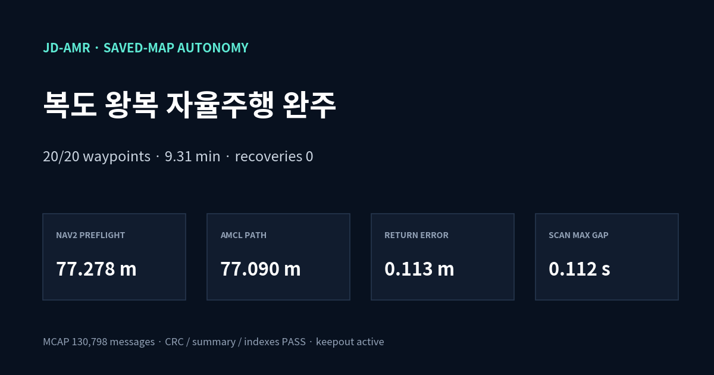

# JD-AMR 안전 자율 매핑

이 패키지는 Cartographer가 갱신하는 `/map`에서 frontier를 고르고, Nav2에 한 번에 목표 하나만 전달한다. `frontier_explorer`는 시작 시 항상 `IDLE`이며 직접 `/cmd_vel`을 발행하지 않는다. 최종 속도 명령은 Collision Monitor만 `/cmd_vel`에 발행해야 한다.

실기 launch는 파이에서 재현된 Fast DDS 공유메모리 user-data 장애를 피하도록 자식 노드 시작 전에 `FASTDDS_BUILTIN_TRANSPORTS=UDPv4`를 설정한다. 센서 bringup은 `ROS_AUTOMATIC_DISCOVERY_RANGE=LOCALHOST`로 유지해 원시 `/scan`·`/odom`을 무선 DDS에서 분리한다. 현재 파이의 Jazzy/Fast DDS에서는 같은 호스트의 `LOCALHOST` subscriber가 endpoint 이름만 찾고 user data를 받지 못하는 현상을 재현했으므로, 온보드 Nav2·기록기·경로 실행기만 `SUBNET` participant로 기동한다. 같은 호스트의 `SUBNET` subscriber와 `LOCALHOST` sensor publisher 사이 데이터 전달 및 반대 방향의 명령 토픽 전달을 확인했다. 로봇의 ROS domain은 12이며 비대화형 셸에서는 `.bashrc`가 적용되지 않을 수 있으므로 전용 launch와 자동 실행기를 사용한다.

## 시작 전 안전 조건

- 로봇은 바닥의 평평하고 열린 곳에 정지시킨다. 사람, 반려동물, 케이블, 계단과 낙하 지점을 작업 구역에서 치운다.
- 작업자는 로봇 옆에서 전원을 즉시 끌 수 있어야 한다. 무인 운전이나 다른 방에서의 운전을 금지한다.
- 3S 배터리 전압과 구동 상태를 먼저 확인한다. explorer는 `/battery_state`가 10초보다 오래됐거나 전압이 10.5V 미만이면 `battery_ok=False`로 판단해 시작·재개와 계속 주행을 fail-closed로 막는다. 센서 자동 차단과 별개로 작업자도 전압을 확인한다.
- `jdamr-webteleop`을 중지하고 `/cmd_vel` publisher가 Collision Monitor 하나뿐인지 확인한다. webteleop은 `/cmd_vel`을 직접 발행하므로 함께 실행하면 explorer가 시작을 거부한다.
- `/scan`, `/map`, `/odom`, `map -> base_footprint` TF가 최신인지, Nav2 planner/navigator가 준비됐는지, Collision Monitor lifecycle `ACTIVE` 응답이 1초 이내인지 확인한다.
- G4는 높이 약 0.1 m의 단일 평면만 본다. 투명 물체, 검은/반사 재질, 라이다 평면보다 낮거나 높은 장애물, 빠르게 움직이는 사람을 확실히 검출하지 못한다. Collision Monitor는 안전 인증 장치가 아니며 작업자의 감시를 대체하지 않는다.

## 실행과 수동 제어

방 전체를 자동 탐색하지 않고 필요한 서비스 구역만 수동으로 지도화할 때는
`jdamr-operator-mapping.service`를 사용한다. 이 모드는 Cartographer, map saver,
화이트톤 웹 조종기를 한 서비스로 실행한다. 수동 조종 명령은 출발 점검, 방향별
라이다 판정, velocity smoother와 Collision Monitor를 거치지 않고 `/cmd_vel`로
전달한다. 버튼을 놓거나 브라우저 연결이 끊기면 0속도를 보내는 데드맨과 베이스
드라이버·펌웨어 워치독은 유지한다.

```bash
sudo systemctl start jdamr-operator-mapping.service
```

같은 무선망에서 `http://jdamr.local:8080`을 연다. 전진·후진·좌회전·우회전 버튼은
센서 상태와 주변 장애물에 따라 비활성화되지 않는다. 이 모드는 작업자가 차체를 보면서
지도를 생성할 때만 사용하며, 자율주행은 별도의 Nav2 보호 경로를 사용한다.

빌드 후 환경을 source하고 Cartographer 및 하드웨어가 이미 실행 중인 상태에서 자율 매핑 launch를 실행한다.

```bash
source /opt/ros/jazzy/setup.bash
source ~/jdamr_cube_ws/install/setup.bash
export ROS_DOMAIN_ID="${ROS_DOMAIN_ID:-12}"
export ROS_AUTOMATIC_DISCOVERY_RANGE="${ROS_AUTOMATIC_DISCOVERY_RANGE:-LOCALHOST}"
export FASTDDS_BUILTIN_TRANSPORTS="${FASTDDS_BUILTIN_TRANSPORTS:-UDPv4}"
ros2 launch jdamr_cube_navigation autonomous_mapping.launch.py use_sim_time:=false
```

## 충전소 출발·단일 테이블 서빙

`restaurant_service serve`는 충전소 정밀주차 → 5초 정지 유지 → 선택 테이블
정밀주차 → 5초 정지 유지 → 동일 충전소 pose 복귀 순서로 동작한다. 물 따르기
단계는 포함하지 않는다. 대기 중 위치·각도 이탈이나 움직임이 관측되면 대기 시간을
다시 계산하고, 제한 시간 안에 정지가 확인되지 않으면 다음 지점으로 출발하지 않는다.
충전소 또는 선택 테이블이 등록되지 않았으면 첫 이동 전에 종료한다.

```bash
source /opt/ros/jazzy/setup.bash
source "$HOME/jdamr_ws/install/setup.bash"
ros2 run jdamr_cube_navigation restaurant_service serve \
  --registry "$HOME/jdamr_data/maps/20260922_manual_final_run2/service_destinations.yaml" \
  --table-id table_01 --log "$HOME/jdamr_data/serve_table_01_plan.jsonl"
```

기본 명령은 현재 위치에서 목적지별 계획을 확인하며 이동하거나 대기하지 않는다.
실행은 새 로그 경로와 `--execute`를 지정한다. 충전소와 테이블은 `teach-home`과
`teach`로 각각 최종 위치·방향을 등록해야 한다. 이미지의 색상 영역 중심을
정밀주차 pose로 간주하지 않는다. 1번 테이블의 90도 방향과 2번의 정면 방향은
각각 교시한 최종 yaw에 담는다. 현재 기능은 지도 기반 주차 추정이며, 박스 면을
센서로 추종해 차체 앞 간격 5cm를 보장하거나 충전을 감지하는 기능은 아니다.

## Depth 박스 정밀주차 관측

2026-09-21 박스 전용 접근 실행부와 반복 출발 검증 절차를 폐기했다.
[실차 실패 및 폐기 기록](evaluation/archive/20260921_BOX_APPROACH_SHADOW.md)은
분석용 보관 자료이며, 그 안의 이전 실행 명령은 사용하지 않는다.
기존 Nav2·지도 기반 서비스 목적지 기능과 속도를 발행하지 않는 Depth 관측기는 유지한다.
이 정리로 테이블 앞 5cm 정차가 구현되거나 검증된 것은 아니다.

테이블별 목적지는 `map` 좌표계의 이름 있는 서비스 pose로 교시하며, 구현 범위와 데이터
형식은 [식당 서비스 목적지 등록 후속 작업](evaluation/20260917_RESTAURANT_SERVICE_DESTINATION_BACKLOG.md)에
분리했다. 지도 기반 서비스 목적지와 이번 박스 상대 접근 계산은 별도 경로다.
완성 전 양팔 서빙 로봇의 선행 왕복 검증은
[서비스 위치 교시·충전소 복귀](evaluation/20260918_RESTAURANT_SERVICE_IMPLEMENTATION.md)의
`지도 생성 → home_dock 교시 → 목적지 교시 → 지점별 박스 관측·대기 → home_dock 복귀` 순서를
사용한다. 이 왕복은 현재 베이스의 지도·주행·인지 상태기계를 검증하며, 충전 접점 체결이나
팔 작업 성공을 뜻하지 않는다.

박스 앞 정밀주차의 1단계는 태그 없이 Depth에서 보이는 평면을 검출한다. 현재 낮은 카메라
위치에서는 상판보다 전면이 안정적으로 보이므로 `surface_mode=front`를 사용한다. 카메라를
높인 뒤에는 `surface_mode=top`으로 바꿔 같은 관측 구조를 사용할 수 있다. 검출기는 카메라
optical frame 기준 박스 전면 거리, 좌우 오차, 평면 각도, 폭·높이와 신뢰도를
`/box_parking/perception_status`에 JSON으로 발행한다. 8개 연속 관측의 거리·좌우·각도
분산이 설정 범위 안에 들어와야 `stable=true`가 된다.

이 노드는 관측 전용이다. `/cmd_vel`을 발행하지 않고 `control_ready=false`를 유지하므로
로봇을 움직이지 않는다. 박스를 실제로 반복 검출하고 카메라 외부 파라미터와 정지 오차를
실측하기 전에는 정밀 접근 제어에 연결하지 않는다. 이후 제어 단계는 Nav2가 박스 근처의
대기 위치까지 이동하고, 안정화된 Depth 상대 오차로 마지막 구간만 저속 보정하며, 2D
라이다와 Collision Monitor는 충돌 정지를 담당하는 구조로 결합한다.

```bash
cd "$HOME/jdamr_rgbd_ws"
source /opt/ros/jazzy/setup.bash
source install/setup.bash
export ROS_DOMAIN_ID=12
export ROS_AUTOMATIC_DISCOVERY_RANGE=LOCALHOST
ros2 launch jdamr_cube_navigation depth_box_parking.launch.py
ros2 topic echo --full-length /box_parking/perception_status
```

실차 파이의 배포 워크스페이스는 `$HOME/jdamr_ws`다. 2026-09-17 정지 장면에서 관측
노드만 추가로 실행했을 때 토픽은 평균 4.609 Hz였고, 박스가 없는 장면은
`reason=no_box_surface_candidate`로 거부했다. 같은 위치에 박스를 둔 뒤 전면 검출은 거리
0.762m, 우측 편차 약 0.0224m, 평면 각도 약 -1.05°, 폭 약 0.321m, 높이 약 0.186m,
신뢰도 약 0.97로 연속 `stable=true`를 유지했다. 이는 정지 상태의 상대 자세 관측
증거이며 방향 제어 또는 5cm 주차 성능의 증거는 아니다.

같은 날 박스를 카메라 오른쪽으로 옮긴 방향 부호 시험에서는 전진 명령 없이
`angular.z=-0.05rad/s`를 2초간 발행했다. 시험 전 웹 조종기를 중지해 `/cmd_vel`
발행자를 시험 노드 하나로 제한했고, 종료 시 0속도를 반복 발행했다. 박스 우측 편차는
0.1284m에서 0.0391m로 약 69.5% 감소해 우회전 부호를 확인했다. 평면 각도는 -2.34°에서
+3.63°로 변했으므로, 최종 주차는 제자리 회전 하나로 처리하지 않고 전진 곡선으로 중심선에
접근한 뒤 평면 각도를 별도로 맞춰야 한다. 이 시험은 방향 부호 검증이며 연속 폐루프 제어나
최종 정지 정확도 검증은 아니다.

차체 앞면과 카메라 렌즈면이 같은 현재 장착에서 물리 간격 5cm를 목표로 할 때의 센서
사각지대 계산, Depth→라이다 전환과 근거리 센서 대안은
[Depth 박스 정밀주차 설계](evaluation/20260917_DEPTH_BOX_PARKING_DESIGN.md)를 따른다.

## 저장 지도 자율주행의 금지구역

복도 반복 수집처럼 이미 저장된 지도로 이동할 때는 `keepout_navigation.launch.py`만 사용한다. 이 launch는 AMCL과 저장 지도로 위치를 잡고, 동일한 금지구역 마스크를 global/local costmap에 함께 적용하며 전용 RViz도 기본으로 연다. RViz에는 원본 지도, `/keepout_filter_mask`, AMCL 파티클, 라이다, 전역 계획 경로와 초기 위치·Nav2 목표 도구가 미리 설정돼 있다. 마스크 또는 filter info 서버가 종료되면 전체 자율주행도 종료한다. 일반 `navigation.launch.py`의 `use_keepout:=false` 상태로 복도 자율주행을 시작하지 않는다.

2026-09-01 RViz `Publish Point`로 확정한 두 영역은 `config/keepout_zones.autonomous_20260826.yaml`에 map-frame 다각형으로 반영했다. 왼쪽 계단 입구는 0.55m 팽창 뒤 경계가 실제 벽선과 일치하도록 보정했고, 오른쪽 가지도 입구 전체를 막았다. 마스크 생성기는 본선의 지정 시작점 `(-0.002, 0.000)`에서 끝점 `(37.498, -4.300)`까지 0.25m 장애물 여유를 적용한 격자 연결성을 다시 계산하며, 경로가 끊기면 파일 생성을 거부한다. 현재 저장 지도에 사용할 마스크는 아래 명령으로 재생성한다.

```bash
cd "$HOME/jdamr_cube_ws"
source /opt/ros/jazzy/setup.bash
source install/setup.bash
ros2 run jdamr_cube_navigation keepout_mask build \
  --zones "$HOME/jdamr_cube_ws/src/jdamr_cube_ros/jdamr_cube_navigation/config/keepout_zones.autonomous_20260826.yaml" \
  --output-prefix "$HOME/maps/autonomous_20260826T161908_keepout_multi" \
  --force
ros2 run jdamr_cube_navigation keepout_mask validate \
  --map "$HOME/maps/autonomous_20260826T161908.yaml" \
  --mask "$HOME/maps/autonomous_20260826T161908_keepout_multi.yaml"
```

금지구역 좌표를 다시 정하려면 전용 capture launch를 실행하고 RViz의 `Publish Point`로 경계 꼭짓점을 클릭한다. 아래 예시는 네 번 클릭할 때마다 사각형 한 곳을 저장하며, 클릭 순서와 무관하게 중심점 둘레로 꼭짓점을 정렬해 교차 다각형을 방지한다. 저장 뒤 화면은 열린 상태를 유지하므로 다음 사각형을 계속 네 번 클릭할 수 있다. 모든 사각형을 다 찍은 뒤 launch 터미널에서 `Ctrl-C`로 종료한다. 완성된 사각형은 하나의 YAML에 `keepout_area_1`, `keepout_area_2` 순으로 누적되고, 미완성 클릭은 저장하지 않는다. 이 launch는 저장 지도 server, RViz, 클릭 수집기만 실행하며 planner, controller, navigator를 시작하지 않으므로 목표나 속도 명령을 보내지 않는다.

```bash
cd "$HOME/jdamr_cube_ws"
source /opt/ros/jazzy/setup.bash
source install/setup.bash
ros2 launch jdamr_cube_navigation keepout_capture.launch.py \
  map:="$HOME/maps/autonomous_20260826T161908.yaml" \
  output:="$HOME/maps/autonomous_20260826T161908_keepout_zones.yaml" \
  zone_id:=stairs \
  point_count:=4 \
  margin:=0.55
```

`margin 0.55`는 금지 다각형 바깥으로 추가 차단하는 거리다. 도구는 0.35m 미만을 거부하며, 실제 위치추정 오차가 크면 더 늘린다. 클릭 결과를 마스크로 만들고 원본 지도와 크기·해상도·원점이 같은지 검증한다.

```bash
ros2 run jdamr_cube_navigation keepout_mask build \
  --zones "$HOME/maps/autonomous_20260826T161908_keepout_zones.yaml" \
  --output-prefix "$HOME/maps/autonomous_20260826T161908_keepout"
ros2 run jdamr_cube_navigation keepout_mask validate \
  --map "$HOME/maps/autonomous_20260826T161908.yaml" \
  --mask "$HOME/maps/autonomous_20260826T161908_keepout.yaml"
```

활성화 전에는 RViz에 `/keepout_filter_mask`를 Map display로 추가해 원본 지도와 겹쳐 보고, 두 서버가 `active`인지 확인한다. 금지구역 안 waypoint나 경로 실패는 건너뛰지 않고 전체 waypoint 실행을 중단한다.

```bash
ros2 launch jdamr_cube_navigation keepout_navigation.launch.py \
  map:="$HOME/maps/autonomous_20260826T161908.yaml" \
  keepout_mask:="$HOME/maps/autonomous_20260826T161908_keepout.yaml"
ros2 lifecycle get /keepout_filter_mask_server
ros2 lifecycle get /keepout_costmap_filter_info_server
ros2 topic echo --once /keepout_costmap_filter_info
```

단일 PC 정적 진단에서는 `keepout_navigation.launch.py`의 RViz 기본값을 사용할 수 있다.
파이 온보드 실차 주행에서는 아래 전용 wrapper가 RViz를 포함하지 않는다. 마스크는 출발
전에 `keepout_mask validate`와 전체 경로 planning-only로 검증하고, 주행 뒤 bag을
노트북에서 재생해 지도·마스크·AMCL·계획 경로를 확인한다.

이 모드는 기존 지도를 경로 통제에만 사용한다. 실차 수집 중 Cartographer나 SLAM Toolbox mapping을 동시에 실행하지 않는다. 원시 `/scan`, `/odom`, TF를 bag으로 기록한 뒤, `offline_replay_guard.launch.py`로 `/map`과 이동 명령을 재생 목록에서 제외하고 기록된 AMCL의 `map -> odom`을 TF에서 제거한다. 새 mapping backend는 격리 domain의 빈 상태에서 실행한다. 따라서 Keepout이나 저장 지도가 새 지도 결과를 덮어쓰거나 정답으로 주입되지 않는다. 실행 절차는 `evaluation/README.md`의 "저장 지도 주행 bag의 오프라인 SLAM 재생"을 따른다.

## Wi-Fi 비의존 실차 구조

2026-09-01 복도 왕복에서는 노트북에서 Nav2·RViz·rosbag을 함께 실행하자 복도 끝에서
ping 20% 손실, 평균 약 710ms, 최대 약 1.1초 지연이 발생했다. `/scan`, `/odom`, TF가
2초 이상 늦어져 Collision Monitor가 정지했고, recorder 종료 직후 센서가 다시
수신됐다. 이 결과로 실차의 제어 루프와 원본 데이터 수집을 Wi-Fi 건너편에서 실행하는
구성을 폐기한다.

2026-09-04 14:24 실주행에서는 무선 association과 같은 BSSID가 유지됐고 신호도
-58~-64 dBm이었으며 커널·wpa_supplicant 로그에 disconnect/deauth가 없었다. 하지만
MCAP에서 `/scan` 11.687초, `/odom` 6.707초, `/imu/data_raw` 6.725초의 최대 기록 공백이
동시에 나타났고 Nav2 lifecycle bond도 무너졌다. 당시 노트북의 장기 실행 대시보드 노드가
파이의 원시 센서 토픽을 구독하고 있었다. bringup만 띄운 상태에서 파이의 무선 송신량은
약 287.7 KiB/s·325.2 packet/s였고, DDS discovery를 `LOCALHOST`로 제한한 뒤
0.3 KiB/s·0.8 packet/s로 내려갔다. 따라서 관측된 "Wi-Fi 끊김"은 RF 접속 해제로
확정할 수 없으며, DDS 센서 경로가 무선망과 결합된 것이 우선 해결할 구조적 문제다.

파이에는 하드웨어 bringup이 먼저 실행돼 있어야 한다. 그 위에는 저장 지도·AMCL,
controller, planner, velocity smoother, Collision Monitor, BT navigator, Keepout,
경로 실행기, 필수 토픽 MCAP recorder만 둔다. 기본 `corridor` 프로필은 쓰지 않는 smoother
server, route server, behavior server, waypoint follower, docking server를 실행하지
않는다. `obstacle_candidate` 프로필은 같은 합성 컨테이너에 Wait 전용 behavior server만
추가한다. RViz, Cartographer·SLAM Toolbox, 그래프·통계 계산, bag 재생은 주행 중 파이에
띄우지 않는다. 필수 Nav2 서버는 `component_container_isolated` 하나에 합성하고,
lifecycle manager와 graph liveness guard는 별도 프로세스로 둔다. 컨테이너가 살아 있어도
내부 노드가 graph에서 사라지는 장애를 별도 guard가 감지해 전체 navigation을 종료한다.
recorder는 CPU nice 10과 I/O best-effort 최저 우선순위 7로 실행해 제어 루프가 먼저
스케줄되게 한다. 기본 기록도 `/scan`, `/odom`, TF, IMU, 제어 전·후 속도, AMCL,
배터리, 계획, Collision Monitor 상태, 목표 UUID와 실행 상태로 제한하며
RViz용 `/joint_states`는 제외한다. 숨겨진 action status 토픽도 명시적으로 기록한다.
고주기 토픽은 best-effort로 구독해 기록기가 reliable 전달을 요구하지 않게 한다.
recorder가 예상치 않게 끝나면 navigation도 종료한다.

온보드 장애물 후보·파이 반영 상태·동일 목표 재개 판정은
[2026-09-08 실행 점검](evaluation/20260908_PURPOSE_AND_RUNTIME_AUDIT.md)에 정리했다.
후보를 고를 때는 자동 실행기의 `--navigation-profile obstacle_candidate`가 launch와
route에 같은 값을 전달한다. 따로 실행하면 launch의 `navigation_profile`과 route의
`--navigation-profile`을 모두 맞춰야 한다. 옵션을 생략하면 `corridor`다.

팔이 장착되지 않은 실차는 `--navigation-profile obstacle_base_candidate`를 사용한다.
이 프로필은 같은 온라인 재계획 BT와 Wait 복구를 사용하지만 가짜 `/joint_states`를
팔 수납 증거로 사용하지 않는다. 차체 전방 외곽과 기존 속도·scan gap·감속도 계약에서
유도한 StopZone 0.35 m·SlowdownZone 0.45 m는
`config/base_obstacle_protection.yaml`에 근거와 함께 둔다. 팔을 다시 장착하면 이
프로필을 사용하지 않고 실제 관절 telemetry가 연결된 `obstacle_candidate`로 돌아간다.

실차 사용 횟수를 줄이는 장애물 검증은 고정 장애물 우회, 이동 장애물 정지·동일 목표
재개, Keepout 준수와 원점 복귀를 왕복 한 번에 순차 수집한다. 각 사건을 동시에 만들지
않으며, 통합 실행 명령과 성공 판정은
[2026-09-09 실차 통합 절차](evaluation/20260909_REAL_COMBINED_TRIAL.md)를 따른다.

합성 컨테이너에는 자식 costmap용 ParameterFile도 전달한다. Keepout 서버의 ACTIVE만으로
적용 완료라고 판단하지 않고, 양쪽 costmap의 필터 활성과 mask 수신도 확인한다.
현재 후보의 검증 범위는 위 점검 문서가 기준이며, 파일 배포를 실차 검증으로 해석하지 않는다.

```bash
cd "$HOME/jdamr_ws"
source /opt/ros/jazzy/setup.bash
source install/setup.bash
export ROS_DOMAIN_ID=12
export ROS_AUTOMATIC_DISCOVERY_RANGE=LOCALHOST
export FASTDDS_BUILTIN_TRANSPORTS=UDPv4
ros2 launch jdamr_cube_navigation onboard_keepout_navigation.launch.py \
  map:="$HOME/maps/autonomous_20260826T161908.yaml" \
  keepout_mask:="$HOME/maps/autonomous_20260826T161908_keepout_multi.yaml"
```

원시 센서 publisher는 `LOCALHOST`이므로 노트북 RViz에서 `/scan`·`/odom`이 보이지 않는
것이 정상이다. 온보드 Nav2 participant는 센서 user data를 받기 위해 `SUBNET`이지만,
주행 중 노트북에서 RViz나 센서 구독자를 실행하지 않는다.
노트북에서는 RViz와 rosbag을 실행하지 않고 SSH로 텍스트 로그와 종료 상태만 확인한다.
`keepout_operator_view.launch.py`는 실차 자율주행과 동시에 쓰지 않는 단일 호스트 정적
진단용이다. 시각 검토는 주행 종료 뒤 로컬로 복사한 bag과
`evaluation/README.md`의 격리 domain 재생 절차로 수행한다.

검증된 20-point 왕복 경로는
`config/corridor_roundtrip.autonomous_20260826.yaml`에 저장돼 있다. 다음 두 명령도
파이에서 실행한다. 첫 명령은 80m 전체 경로를 계획만 하고, 두 번째 명령만 실제로
움직인다. `corridor_route`는 waypoint마다 경로를 한 번만 계산하고 따르는 복도 전용
fail-fast BT를 명시한다. 회전·후진 복구는 사용하지 않고, 일시적 TF·controller 실패에는
코스트맵 초기화 뒤 제한된 재시도만 수행한다. 배터리·scan·odom freshness가 깨지면 현재
목표를 취소하며 다음 waypoint를 보내지 않는다. AMCL freshness는 출발 준비에서만
확인하고, 주행 중에는 정지 상태의 미발행만으로 취소하지 않는다. 전체 경로는 현재 AMCL
위치가 지도상의 home에서 1m 이내일 때만 시작하고, 중간 재개는 첫 잔여 waypoint와의
거리 제한을 통과해야 한다. 복도 전용 BT는 일반 주행용
방향 검사기를 바꾸지 않고 `position_goal_checker`를 선택해, 최종 home을 방향이 아니라
위치 복귀로 판정한다.

```bash
ros2 run jdamr_cube_navigation corridor_route \
  --route "$HOME/jdamr_ws/src/jdamr_cube_ros/jdamr_cube_navigation/config/corridor_roundtrip.autonomous_20260826.yaml"
ros2 run jdamr_cube_navigation corridor_route \
  --route "$HOME/jdamr_ws/src/jdamr_cube_ros/jdamr_cube_navigation/config/corridor_roundtrip.autonomous_20260826.yaml" \
  --execute
```

실측 수치와 해시는 `evaluation/20260904_CORRIDOR_LOCALDDS_SUCCESS.md`와 증거 원장을
기준으로 한다. `corridor_localdds_armed_20260904T152036`은 77.278m 사전 계획의 20개
목표를 복구 없이 마치고 출발점으로 돌아왔다. AMCL 누적 경로는 77.090m, 첫 위치와
마지막 위치 사이는 0.113m였다. 130,798개 메시지를 담은 MCAP은 chunk, data-section,
summary CRC와 인덱스 검사를 통과했다.

직전 실패 기록과 같은 주행 구간 계산을 적용하면 `/scan` 최대 공백은 10.750초에서
0.112초로 줄었다. `/odom`과 `/imu/data_raw`는 0.029초, `map -> odom` TF는 0.167초를
넘지 않았다. 로봇 DDS를 무선망에서 분리한 뒤 lifecycle bond 상실과 scan stale 취소가
재현되지 않은 결과다. recorder transport-loss 카운터는 남지 않아 증거 원장 등급은
`PARTIAL_SUCCESS`로 두었다. 완주 결과와 데이터 사용 가능 여부는 분리해서 기록한다.



프로세스별 CPU의 과거 표는 구버전 계측기의 오분류 때문에 소급 검증할 수 없다. 수정된
`soak_metrics`는 전체 시스템 CPU로 자원 여유를 판정하고 프로세스별 CPU는 원인 귀속에
쓴다. recorder와 `nav2_container` 또는 독립 Nav2 필수 집합이 최신 60초 동안 함께
측정되고 인접 샘플 간격이 10초 이하여야 통과하며, 빈 시점도 sentinel로 기록한다.
`corridor_autorun.sh`는 Nav2 기동·사전점검·계획 중 쌓인 최신 표본으로 이 자원 게이트를
실제 출발 전에 실행하며 별도의 고정 대기를 추가하지 않는다. 로컬 DDS
비주행 소크와 복도 전체 왕복을 모두 마쳤다. 다음 분석은 성공 bag을 Cartographer와
SLAM Toolbox에 격리 재생하고, 센서 노이즈와 timestamp jitter 분포를 구하는 작업이다.
반복 실주행은 성공률 수치가 필요할 때만 추가한다. 실제 출발 시 작업자가 로봇 옆에서
물리 전원을 즉시 차단할 수 있어야 한다.

자율 매핑은 항상 `autonomous_mapping.launch.py`로 실행한다. `ros2 run jdamr_cube_navigation frontier_explorer` 단독 실행은 explorer 오류 시 전체 Nav2 종료를 보장하지 않으므로 금지한다.

파이 저장지도 주행은 현재 필요한 Nav2 서버를 `component_container_isolated` 하나에
합성하고 lifecycle manager와 graph liveness guard를 별도 프로세스로 둔다. isolated
container는 구성요소마다 전용 single-thread executor와 OS thread를 두므로 여러 Nav2
구성요소는 병렬 실행된다. 구성요소 내부에 스레드를 추가하는 것은 정지 판단의 callback
queue 지연이 계측된 경우에만 A/B 시험한다. 이 구성에서
intra-process 통신을 명시적으로 켜지는 않았으므로 composition과 zero-copy를 같은 뜻으로
설명하지 않는다. 베이스 센서·TF 발행 주기와 자율 매핑의 explorer 종료 처리는 별도
launch 계약을 따른다.

운용 종료는 launch를 실행한 터미널의 `Ctrl-C` 또는 launch process group 종료로 수행한다.
Nav2 자식 프로세스 하나만 직접 `kill`하면 lifecycle 정리와 recorder 마감을 확인하기
어렵다. 현재 복도 구성은 합성 컨테이너와 graph liveness guard를 함께 사용하며,
`corridor_autorun.sh`는 자신이 시작한 프로세스 그룹만 추적해 종료한다. 종료 뒤
Nav2·recorder 잔류 0, `metadata.yaml` 생성, `/cmd_vel` publisher 0을 확인한다.
`--delay`는 Nav2 기동 전에 적용한다. 로봇을 배치한 뒤에는 AMCL·사전 계획·자원 게이트가
끝날 때까지 옮기지 않는다.

2026-08-26 팔 장착 전 실기 자율탐사에서는 최종 상태 `FINISHED`, `save=succeeded`, `readiness_missing=none`을 확인했다. 저장 지도는 894×212셀(0.05m/셀), 오도메트리 누적 경로는 45.018m였다. 이 결과는 당시 복도와 작업자 감시 조건에서의 자율 매핑 기록이며 안전 인증이나 무인 운전 승인을 뜻하지 않는다.

`autostart:=true` 기본값은 Nav2와 map saver lifecycle 노드를 활성화할 뿐이다. explorer는 자동 출발하지 않고 `IDLE`을 유지한다. 안정 운용 API는 다음과 같다.

```bash
ros2 service call /autonomy/start std_srvs/srv/Trigger '{}'
ros2 service call /autonomy/pause std_srvs/srv/Trigger '{}'
ros2 service call /autonomy/resume std_srvs/srv/Trigger '{}'
ros2 service call /autonomy/stop std_srvs/srv/Trigger '{}'
```

기존 `/frontier_explorer/start`, `/frontier_explorer/pause`, `/frontier_explorer/resume`, `/frontier_explorer/stop`도 호환 alias로 유지된다. 새 운용 스크립트에는 `/autonomy/*`를 사용한다.

`start`와 `resume`은 최신 odom으로 확인한 로봇 정지, 최신 map/scan/TF와 배터리, Collision Monitor `ACTIVE`, planner/navigator 준비, `/cmd_vel` 단일 소유가 모두 확인되지 않으면 실패한다. 목표가 진행 중일 때 map/scan/TF/odom의 짧은 freshness 공백은 explorer가 중복으로 `PAUSED`에 고정하지 않는다. Nav2 controller와 Collision Monitor가 데이터를 기다리며 자동 회복한다. Collision Monitor 비활성, planner/navigator 이탈, 명령 소유권 충돌, 저전압과 `/probe_abort`는 그대로 목표를 취소하고 `PAUSED`에 머문다.

SELECT 상태에서 현재 robot pose가 지도 밖이거나 known-free가 아니면 다음 지도 갱신까지 기다린다. 움직임이 없는 단계라 수동 복구를 요구하지 않는다. 최종 경로 가능 여부는 `allow_unknown=false`인 Nav2 global costmap과 planner 결과가 판정한다.

Nav2 목표 취소가 3초 안에 응답하지 않거나 취소가 거부되면 explorer는 오류로 종료한다. launch는 explorer 프로세스 종료를 감지하면 전체 자율 매핑과 Nav2를 함께 종료하는 fail-closed 경계로 동작한다.

`pause`는 저장 없이 즉시 안전정지를 요청한다. `stop`은 cancellation terminal과 최신 map/odom 기반 정지를 확인한 뒤 지도를 자동 저장하며, 그동안 `save=waiting_for_stop`이다. `motion_transition=clear`와 `save=succeeded`를 확인하기 전에는 별도 저장을 요청하거나 로봇을 들지 않는다.

상태는 `/frontier_explorer/status`에서 `state`, `fault`, `goal`, `battery_voltage`, `battery_ok`, `stationary`, `readiness_missing`, `collision_lifecycle_error`, `save`, `motion_transition`, `frontiers`, `map_sequence` 필드로 확인한다. `readiness_missing`은 시작 또는 운행을 막은 조건이며 `none`이면 누락 조건이 없다. `collision_lifecycle_error`는 최근 Collision Monitor lifecycle 서비스 조회 예외를 `<ExceptionType>: <message>`로 표시하고, 정상 응답을 받으면 `none`으로 복구한다. 이 값이 `none`이 아니면 fail-closed로 운행을 차단한다. 정상 탐색 이동 중 `stationary=false`는 차단 조건으로 중복 표시하지 않고, `SETTLING`에서는 저장 대기 조건으로 표시한다. 새 지도나 새 탐색 세대의 frontier 계산 전에는 `frontiers=unknown`이다.

설정은 후진을 사용하지 않고 낮은 선속도·각속도와 Regulated Pure Pursuit, known-space-only 계획을 사용한다. 그래도 장애물에 접근하면 즉시 `pause` 또는 `stop`하고 필요하면 물리 전원을 끈다.

## 지도 저장과 종료

탐색 완료 또는 `/autonomy/stop` 시 explorer가 취소 완료와 정지 상태를 확인한 뒤 `/map_saver/save_map`을 호출해 기본적으로 `/home/lim/maps/autonomous_YYYYmmddTHHMMSS.{yaml,pgm}`을 저장한다. 저장 요청 직전에 prefix의 부모 디렉터리를 자동 생성하며, 생성할 수 없으면 map saver를 호출하지 않고 `save=failed`로 중단한다. 자동 저장 없이 중간 지도를 수동 저장할 때는 `/autonomy/pause` 후 `motion_transition=clear`와 로봇 정지를 확인하고 안정 API를 호출한다.

```bash
ros2 service call /autonomy/save_map std_srvs/srv/Trigger '{}'
ros2 topic echo --once /frontier_explorer/status
```

수동 저장은 상태가 `IDLE`, `PAUSED`, `FINISHED` 중 하나이고 map이 최신이며 로봇이 정지했고 map saver가 준비됐을 때만 접수된다. Trigger 응답의 `success=true`, `map save request accepted`는 **비동기 요청이 접수됐다는 뜻이지 파일 저장 완료를 뜻하지 않는다.** `/frontier_explorer/status`의 `save`가 `in_progress`에서 `succeeded`로 바뀐 뒤 파일을 확인한다. `rejected`는 요청 미접수, `failed`는 디렉터리 준비 실패 또는 접수 후 저장 실패다.

```bash
ls -lt /home/lim/maps/autonomous_*.yaml /home/lim/maps/autonomous_*.pgm | head
```

YAML의 `image:` 경로가 실제 PGM을 가리키는지 확인한다. **로봇을 들거나 라이다 위치를 바꾸기 전에 반드시 탐색을 중단하고 `save=succeeded`와 파일 생성을 확인한다.** 로봇을 든 채 Cartographer를 계속 실행하면 odom과 scan의 일관성이 깨져 잘 만들어진 지도도 손상된다.
