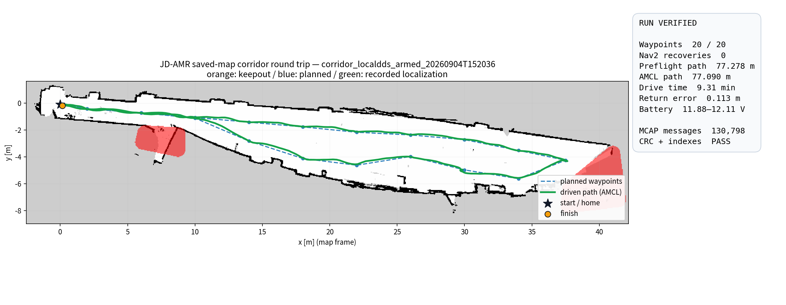
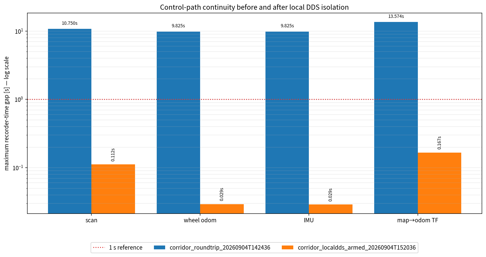
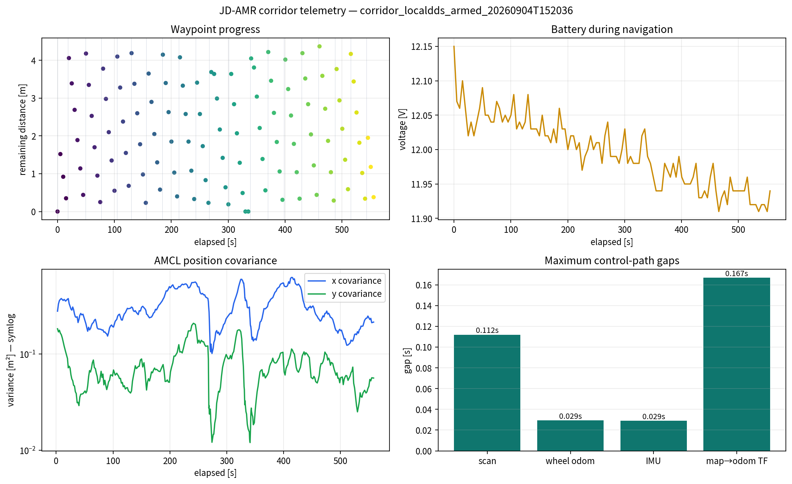
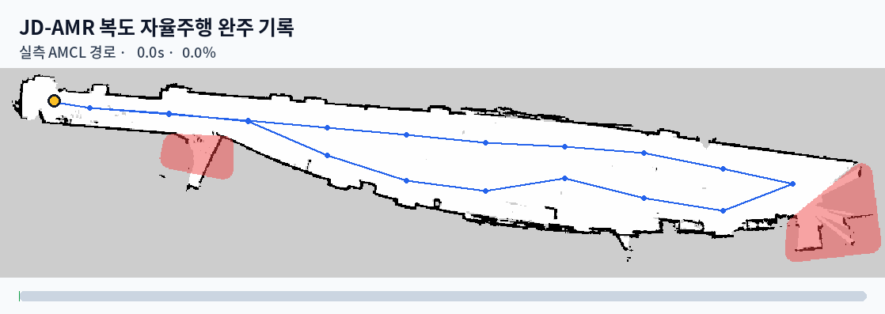

# LOCALHOST DDS 복도 왕복 성공 기록

## 판정

`corridor_localdds_armed_20260904T152036`은 저장 지도와 Keepout을 사용해 같은 복도를
왕복하고 출발점으로 복귀했다. 경로 실행 로그의 20개 목표가 모두 완료됐고 Nav2 복구
동작은 없었다. MCAP의 raw sensor, TF, localization 기록도 주행 전 구간에서 이어졌다.

실차 자율주행 결과는 **SUCCESS**다. 데이터는 경로 재구성, 통신 정체 비교, 센서 특성
분석과 오프라인 2D SLAM 재생에 쓸 수 있다. 다만 recorder가 transport-loss 카운터를
남기지 않았고 전체 capture 자원 게이트가 종료 경계 표본 한 개를 놓쳤다. 그래서 증거
원장에서는 `PARTIAL_SUCCESS`로 등록한다. 이 등급은 완주 실패를 뜻하지 않고,
`PROTOCOL_QUALIFIED`의 모든 provenance를 채우지 못했다는 뜻이다.


## 실행 조건

| 항목 | 값 |
|---|---|
| run id | `corridor_localdds_armed_20260904T152036` |
| 지도 | `$HOME/maps/autonomous_20260826T161908.yaml` |
| 금지구역 | `$HOME/maps/autonomous_20260826T161908_keepout_multi.yaml` |
| 경로 | `config/corridor_roundtrip.autonomous_20260826.yaml` |
| 제어 위치 | Raspberry Pi 온보드 Nav2 |
| DDS discovery | `LOCALHOST` |
| Fast DDS transport | `UDPv4` |
| 시각화 | 주행 중 RViz 미실행, 종료 뒤 MCAP으로 생성 |
| 기록 | MCAP, 고주기 센서 best-effort 구독 |

이 구성은 제어와 원시 센서 전달을 무선 DDS에서 분리한다. SSH나 노트북 ROS graph 상태가
주행 루프에 들어가지 않는다.

## 주행 결과

| 지표 | 결과 | 근거 |
|---|---:|---|
| 목표 완료 | 20 / 20 | `route.log`의 `send`, Nav2 `Goal succeeded` 각각 20건 |
| 사전 계획 경로 | 77.278 m | Nav2 planning-only 결과, 3,048 poses |
| AMCL 누적 경로 | 77.090 m | 주행 시작부터 성공 시각까지 324 samples |
| 실행 시간 | 558.690 s | 첫 목표 전송부터 성공 로그까지 |
| Nav2 복구 | 0회 | 모든 목표 상태 로그의 최대값 |
| 출발점 대비 복귀 오차 | 0.113 m | 첫 AMCL 위치와 마지막 AMCL 위치 거리 |
| 지정 home 오차 | 0.180 m | 마지막 AMCL 위치와 `(0.00, -0.10)` 거리 |
| 최대 진행 x | 37.640 m | AMCL |
| 배터리 | 11.884~12.112 V | 주행 구간 `/battery_state` |
| 종료 명령 | 최종 zero | 성공 뒤 `/cmd_vel` 표본 10건의 마지막 값 |

AMCL은 저장 지도에 대한 localization 추정치다. 외부 ground truth가 없으므로 0.113m를
ATE나 절대 위치 정확도로 부르지 않는다. 이 값은 폐루프 복귀 일관성으로만 사용한다.



## 멈춤 문제의 전후 비교

두 기록을 첫 목표 전송부터 실행기 마지막 로그까지 같은 코드로 다시 계산했다. 마지막
메시지 뒤의 무응답 시간도 최대 공백에 포함했다.

| 제어 경로 | 14:24 실패 | LOCALHOST DDS 완주 | 최대 공백 감소 |
|---|---:|---:|---:|
| `/scan` | 10.750 s | 0.112 s | 96.0배 |
| `/odom` | 9.825 s | 0.029 s | 334.9배 |
| `/imu/data_raw` | 9.825 s | 0.029 s | 339.5배 |
| `map→odom` TF | 13.574 s | 0.167 s | 81.4배 |

14:24 기록에서는 waypoint 4 도중 네 스트림이 함께 멈추고 scan freshness가 실행을
취소했다. 이번에는 같은 지점을 지나 turnaround와 복귀 경로까지 센서와 TF가 이어졌고,
lifecycle bond 상실이나 경로 취소가 없었다. 같은 날 전후 기록은 로컬 DDS 격리가 멈춤
문제를 해결했다는 강한 근거다. 다른 변수를 무작위로 교차한 시험은 아니므로 유일한
원인이라고 단정하지 않는다.



## 기록 무결성과 사용 범위

| 항목 | 결과 |
|---|---:|
| MCAP 크기 | 111,489,625 bytes |
| 전체 메시지 | 130,798 |
| 전체 기록 시간 | 756.229 s |
| SHA-256 | `65105177e43eca6153d2543f3cf8e9cc9f7c62b77f258975fdcdbd10b5e2e16a` |
| chunk CRC | 105 / 105 PASS |
| data-section CRC | PASS |
| summary CRC | PASS |
| chunk indexes | 105 |
| message indexes | 782 |

MCAP에는 `/scan`, `/odom`, `/imu/data_raw`, `/tf`, `/tf_static`, `/cmd_vel`,
`/cmd_vel_nav`, `/amcl_pose`, `/battery_state`, `/plan`이 들어 있다. Keepout 저장 지도는
오프라인 SLAM 재생에 넣지 않는다. `offline_replay_guard.launch.py`가 저장된
`map→odom`을 제거한 raw sensor/odom/TF만 새 backend에 공급한다.



## 자원 로그 판정

주행 구간 기술 통계는 4코어 기준 시스템 CPU 평균 232.8%, p90 237.1%, 최대 258.4%,
최고 온도 68.7°C, throttle 표본 0건이다. `nav2_container` 평균 CPU는 95.2%였다.

전체 TSV를 기존 `soak_metrics --evaluate`로 판정하면 process coverage가 147/148이라
FAIL이다. 마지막 종료 경계 표본 한 개를 놓친 결과이며 CPU, 온도, throttle 게이트는
PASS했다. 이 값은 주행 중 자원 상태를 설명하는 자료로 남기되 프로토콜 적격 판정에는
쓰지 않는다.

## 생성한 자료

경로는 모두
`jdamr_cube_navigation/evaluation/media/corridor_localdds_armed_20260904T152036/` 아래다.

| 파일 | 용도 |
|---|---|
| `success_card.png` | README와 포트폴리오 대표 이미지 |
| `route_evidence.png` | 지도, Keepout, 계획 경로, 실제 AMCL 경로 |
| `continuity_comparison.png` | 실패 기록과 성공 기록의 최대 공백 비교 |
| `telemetry.png` | 목표 잔여거리, 배터리, AMCL 공분산, 센서 공백 |
| `corridor_roundtrip.gif` | 실제 AMCL timestamp로 만든 왕복 애니메이션 |
| `corridor_roundtrip.mp4` | 브라우저와 발표 자료용 H.264 영상 |
| `metrics.yaml`, `metrics.json` | 집계 수치와 원본 provenance |
| `amcl_trajectory.csv` | 시간, 위치, AMCL 공분산 324행 |
| `route_progress.csv` | 목표별 잔여거리, 복구 횟수, 배터리 |
| `continuity_comparison.csv` | 전후 stream rate, max/p99 gap |
| `media_manifest.yaml` | 생성 파일 크기와 SHA-256 |



## 재생성 명령

```bash
cd "$HOME/jdamr_cube_ws/src/jdamr_cube_ros"
PYTHONNOUSERSITE=1 \
PYTHONPATH="$HOME/.local/share/jdamr-slam-eval/python" \
python3 jdamr_cube_navigation/evaluation/corridor_run_media.py \
  --run-dir "$HOME/jdamr_artifacts/corridor_localdds_armed_20260904T152036" \
  --compare-run-dir "$HOME/jdamr_artifacts/corridor_roundtrip_20260904T142436" \
  --output-dir \
    jdamr_cube_navigation/evaluation/media/corridor_localdds_armed_20260904T152036
```

## 다음 분석

새 실차 주행 없이 이 MCAP으로 다음 두 작업을 진행할 수 있다.

1. Cartographer와 SLAM Toolbox에 같은 77m 구간을 격리 재생해 폐루프 오차, 지도 형태,
   처리시간을 비교한다.
2. scan range, odom increment, IMU 각속도, timestamp jitter의 분위수를 구해 시뮬레이션
   noise와 dropout 범위를 정한다.

추가 주행은 성공률이나 반복성 수치가 필요할 때만 한다. 이번 기록 하나로 완주와 정체
해결은 보여줄 수 있지만, N회 성공률은 주장하지 않는다.
