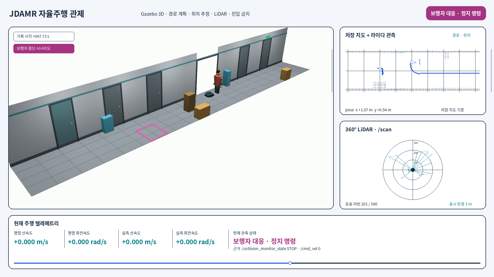

# 장애물 앞에서 멈추고 같은 목표로 다시 주행하기

[최신 관제 대표 영상](dashboard_portfolio_1x.mp4) · [센서 오버레이 영상](gazebo_sensor_dashboard_highlight.mp4) · [보행자 대응 GIF](gazebo_sensor_dashboard_highlight.gif) · [가제보 장면 전체](gazebo_scene_walltime.mp4)



목표를 한 번 받은 로봇이 진입 금지 구역과 지도에 없던 박스를 우회하고,
문에서 나와 통로를 가로지르는 보행자 앞에서 멈춘다.
보행자가 지나간 뒤에는 목표를 취소하거나 다시 받지 않고 주행을 재개해 도착한다.
실제 Gazebo·Nav2 실행을 고정 사선 카메라로 촬영했다.

## 관제에서 확인할 수 있는 것

[화이트 관제 화면](white_dashboard_desktop.png)은 영상과 같은 시점의 센서·주행 상태를 보여준다.
영상 탐색과 일시정지에 맞춰 표시값도 바뀐다.

최신 관제 대표 영상은 웹의 기본 `1×`로 한 번 재생한 36.53초 기록이다.
화면에 표시되는 `1×`는 원본 시간축의 3배속이며, 센서·속도·상세 로그는
영상 시점에 맞춰 갱신된다. 녹화 프레임과 인코딩 정보는
[관제 녹화 정보](dashboard_portfolio_manifest.json)에 남겼다.

- LiDAR: 레이저 거리 센서가 반환한 감지점과 전방 최소 거리
- 명령 속도와 차체 측정 속도: 정지 명령과 실제 정지를 구분하는 근거
- 목표 상태와 변경 이력: 주행·감속·정지·재개가 관측된 시점
- ROS 토픽: 센서와 제어 모듈 사이에 오가는 메시지의 마지막 수신 시점
- Keepout: 진입을 금지한 마스크와 계획 경로, 실제 위치

행동 트리(BT)는 경로 계산·추종·복구의 실행 순서를 정한다.
이번 실행은 실제 선택된 Nav2 트리로 주기적인 경로 재계산과 경로 추종을 수행하고,
실패 시 비용 지도를 지우고 기다리는 복구 구성을 사용한다.
충돌 감시 모듈은 별도로 최종 속도 명령을 정지시킨다.
웹 화면에는 이 구조와 수신한 상태를 구분해서 표시한다.

## 주행 시나리오

이 영상은 목표를 한 번 받은 뒤 아래 상황을 거쳐 도착하는 연속 주행이다.
시나리오 ID는 `detour_sudden_stop_resume`이며, 실행 결과는
[검증 기록](verified_run.json)의 같은 이름 항목에서 확인할 수 있다.

| 상황 | 로봇에 기대하는 대응 | 영상·기록에서 확인할 내용 |
|---|---|---|
| 사전에 지정한 마스킹 구역 | 물리적인 벽이 없어도 진입 금지 구역을 우회한다. | 자홍색 마스크와 실제 차체 위치, 마스크와 차체의 최소 간격 |
| 저장 지도에 없는 고정 장애물 | 직선 주행 경로를 막는 박스를 센서로 감지하고 돌아서 목표로 간다. | LiDAR 감지점, 계획 경로와 실제 이동, 박스와의 최소 간격 |
| 문에서 나와 통로를 횡단하는 보행자 | 충돌 감시 영역에 들어온 장애물에 정지하고, 통로가 확보되면 같은 목표로 주행을 재개한다. | STOP 상태, 최종 속도 명령 0, 실제 차체 정지, 목표 취소 없이 재개와 도착 |

마스킹은 Keepout, 즉 관제에서 미리 지정한 진입 금지 영역이다.
박스는 저장 지도에 없던 장애물을 뜻한다. 주행 도중 박스가 갑자기 생성되는 경우까지
검증했다는 의미는 아니다. 보행자는 시나리오에 따라 문에서 등장해 통로를 가로지른다.

여기서 보행자 감지는 LiDAR 거리 관측에 따른 장애물 감지다. 사람인지 분류하지는 않는다.
정지는 Collision Monitor(충돌 감시 모듈)의 소프트웨어 정지이며,
하드웨어 비상정지나 안전 인증을 받은 기능을 뜻하지 않는다.
재개는 시스템을 다시 켜는 것이 아니라, 진행 중이던 목표를 유지하고 다시 움직이는 것이다.

이번 기록에서는 목표 전송 1회·취소 0회, 실제 정지와 동일 목표 재개·도착,
물리 접촉 0회를 확인했다. 위 시나리오의 시뮬레이션 결과이며 실차 검증과 구분한다.

## 이번 실행의 근거

| 항목 | 결과 |
|---|---:|
| 목표 전송 / 취소 | 1 / 0 |
| 동일 목표 재개와 도착 | 확인 |
| 물리 접촉 | 0회 |
| 보행자와 보호 영역 최소 간격 | 0.10371m |
| 금지 마스크와 차체 최소 간격 | 0.04302m |
| 직선 경로를 막는 박스와 최소 간격 | 0.19870m |

[주행 검증 기록](verified_run.json)의 원본 판정은 PASS다.
차체 방향과 실제 마스크 격자를 반영해 간격을 확인했다.
보호 영역은 차체뿐 아니라 정해진 수납 자세의 팔까지 포함한다.
팔은 화면에서 숨겼지만 충돌 형상과 보호 영역을 삭제하지 않았다.

전체 장면은 약 111.6초다. 메인 영상은 약 84.8초이며,
보행자가 지나간 뒤의 일부 순항 구간에 `8×` 배속을 표시했다.
실제 카메라 수신은 평균 약 18.6fps다. 출력 파일은 프레임 수신 시각을 따라
다음 프레임까지 화면을 유지하는 30fps 형식이며, 실제 센서가 30fps였다는 뜻은 아니다.
웹 관제에는 [앞 3초를 덜어낸 108.6초 장면](gazebo_scene_trim3.mp4)을 배속 없이 사용하고,
페이지를 열면 음소거로 자동재생한다. 센서 기록도 같은 3초만큼 이동해 영상과 맞췄다.
111.6초 원본은 그대로 보존했다.

## 구현 범위

지도는 저장된 지도에 실제 LiDAR 관측·위치 추정·계획 경로를 겹친 것이다.
새 SLAM 지도를 생성하는 영상은 아니다.
보행자는 시나리오용 사람 모델이고, LiDAR와 충돌 검사에는 박스 근사 형상을 사용한다.
사람 분류나 행동 예측, 개별 BT 노드의 실행 로그, 하역·충전·VDA 5050 연동은 포함하지 않는다.
VDA 5050은 관제와 이동 로봇 사이의 주문·상태 통신 규격이다.

횡단 모델의 배치에는 계획된 횡단 시간 동안 로봇이 전진할 거리를 반영했다.
이는 테스트 장면을 만드는 설정이다. 사람 등장 전에 로봇에 감속을 지시하는 로직은 없다.
기존 정지 영역과 통과 판정은 유지했다. 이 결과는 단일 시뮬레이션 검증이며
실차의 반복 성공률이나 안전 인증을 의미하지 않는다.

## 파일과 재현

- [상세 이벤트 로그](detailed_events.json): 감속·정지 요청 영역, 제한 해제, 이동 재개, 마스크 인근 위치 비교, 도착. 시간은 앞 3초를 제거한 영상 기준이다.
- [관제 녹화 정보](dashboard_portfolio_manifest.json): 화면 크기, 재생 배율, 프레임 수, 출력 해시
- [원본·출력 해시와 시간 정렬](render_manifest.json)
- [무배속 장면의 시간 변환 근거](gazebo_scene_walltime.timing.json)
- [브라우저 검증](browser_verification.json): 주행·정지 시점, 일시정지, 모바일 너비, ROS 미연결·오래된 데이터 처리
- [금지 구역 우회](gazebo_keepout_detour.png) · [목표 도착](gazebo_sensor_goal_arrival.png)
- [수정 원인과 재촬영 인계](../../20260909_FIXED_CAMERA_HANDOFF.md)

MCAP은 ROS 메시지를 저장한 기록 파일이다. 원본 MCAP과 전체 관제 영상은
중복 용량을 줄이기 위해 로컬에 보존했고, 경로와 해시는 manifest에 남겼다.

```bash
cd "$HOME/jdamr_cube_ws/src/jdamr_cube_ros"
python3 jdamr_cube_navigation/evaluation/navigation_dashboard.py \
  --no-ros --port 8765 \
  --summary jdamr_cube_navigation/evaluation/media/gazebo_fixed_dashboard_20260909/verified_run.json \
  --video "$HOME/jdamr_artifacts/gazebo_fixed_replay_20260909_trim3/dashboard_scene_walltime.mp4" \
  --replay "$HOME/jdamr_artifacts/gazebo_fixed_replay_20260909_trim3/dashboard_replay_detailed.json"
```

관제 주소는 `http://127.0.0.1:8765/`다. 기록 재생에는 파이와 GPU가 필요하지 않다.
