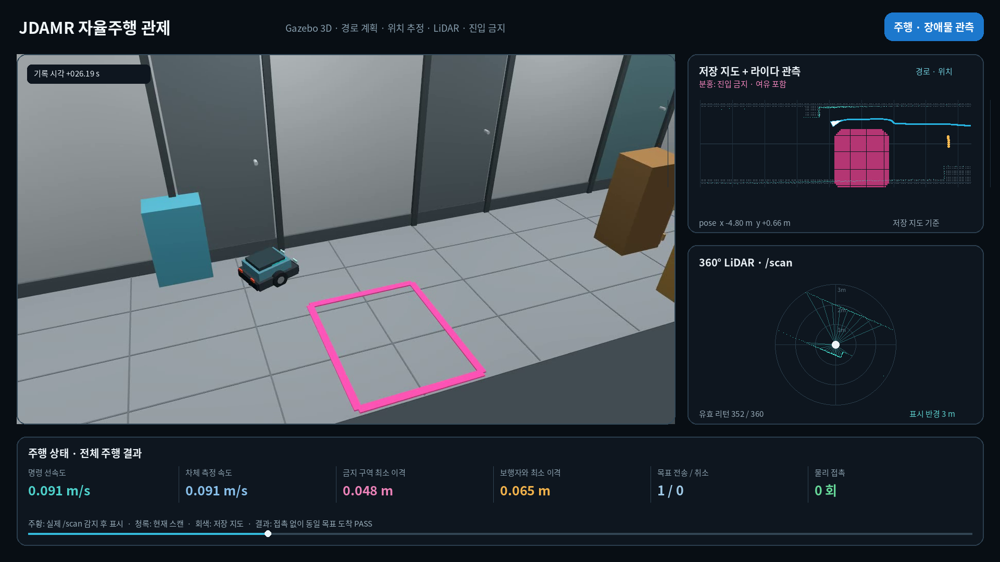

# 금지 구역과 장애물 대응 촬영 기록

이 폴더는 추종 카메라로 촬영한 기존 기록을 보관한다. 화이트톤 웹 관제는 같은 ROS 기록을
영상 시각에 맞춰 재생한다. 고정 카메라와 실제 출입구를 적용한 새 영상은 아직 촬영하지 않았다.

[화이트 관제 화면](white_dashboard_desktop.png)에서 영상과 같은 시점의 LiDAR,
명령·측정 속도, 목표 상태와 ROS 관측 기록을 볼 수 있다.
[브라우저 검증 기록](browser_verification.json)에는 시점 이동, 일시정지,
모바일 너비와 ROS 연결 단절 시 표시 결과를 남겼다.

로봇에 목표를 한 번 전달한 뒤, 진입 금지 구역과 지도에 없던 장애물을 돌아가고 횡단 보행자 앞에서 정지했다가 같은 목표로 주행을 재개하는 Gazebo 시연이다. 3D 장면 옆에서 센서 관측과 계획 경로를 보고, 명령 속도와 차체 측정 속도를 함께 확인할 수 있다.

[기존 촬영 MP4](gazebo_sensor_dashboard_highlight.mp4) · [보행자 대응 GIF](gazebo_sensor_dashboard_highlight.gif)

## 영상에서 확인할 내용

- 분홍색 금지 구역을 피해 계획한 경로와 실제 주행
- 저장 지도에 없는 장애물이 라이다 관측 후 미니맵에 나타나는 과정
- 보행자가 통로 반대편으로 이동하는 동안의 정지 명령과 차체 속도
- 목표를 취소하거나 다시 보내지 않고 도착하는 과정

3D 바닥의 분홍 외곽선은 지정한 영역이고, 미니맵의 분홍 영역은 여유 거리 0.35m를 포함한 실제 마스크다. Keepout은 로봇이 진입하지 않도록 지정한 구역이다. Nav2의 전역·지역 경로용 지도에 모두 적용하고, 경계 주변 비용을 높이는 inflation을 필터 뒤에 추가했다. [Nav2 Keepout 설정 문서](https://docs.nav2.org/rolling/configuration_and_development/configuration_guide/core_servers/costmap_2d/costmap_filters/keepout_filter/)

## 측정 결과

| 항목 | 기록 |
|---|---:|
| 목표 전송 / 취소 | 1 / 0 |
| 목표 도착 | 성공 |
| 물리 접촉 | 0회 |
| 금지 마스크와 차체의 최소 이격 | 0.04783m |
| 비교한 실제 위치 표본 | 1,935개 |
| 비교한 금지 마스크 셀 | 1,252개 |
| 첫 장애물 감지 전 인코딩 프레임 | 90개 |

차체의 방향을 포함한 외곽선과 실제 마스크 격자를 비교했다. 결과는 이번 시뮬레이션의 기록 표본에 관한 것이며, 실차 안전 인증이나 반복 성공률을 뜻하지 않는다.

## 관제와 영상의 데이터

Gazebo 카메라 원본에 `/scan`의 라이다 거리, `/tf`와 `/odom`의 위치·속도, `/plan`의 계획 경로, `/cmd_vel`의 속도 명령을 결합했다. 화면의 현재 관측에는 해당 시각 이전에 수신한 데이터만 사용한다. 저장 지도에서 위치를 추정하며 주행하는 영상으로, 새 SLAM 지도를 생성하는 영상은 아니다.

프레임별 수신 시각으로 센서 기록을 맞췄다. 원본 촬영은 평균 약 21.1fps이고, 파일은 시각에 맞춰 프레임을 유지하는 30fps 형식이다. 전체 기록은 103.6초이며, 메인 영상에서는 보행자 통과 이후의 일부 주행 구간을 `8×`로 표시해 줄였다. 보행자 등장 전 2초의 기록된 명령 속도는 0.18m/s로 일정했다.

사람은 횡단 시나리오용 모델이며, 라이다·충돌 판정에는 박스 형태의 근사 모델을 사용한다. 영상은 사람 분류나 학습 기반 행동 예측을 구현했다는 증거로 사용하지 않는다. 카메라 시야 확보를 위해 복도 한쪽 벽과 천장을 절개도처럼 표시했으며 충돌 형상은 유지했다.

## 원본과 검증

- [최종 주행 검증](verified_run.json)
- [렌더 당시 원본·출력 해시](render_manifest.json)
- [최종 재평가와 렌더 원본의 동일성 확인](verification.json)
- [보행자 정지 장면](gazebo_lidar_pedestrian_stop.png)
- [목표 도착 장면](gazebo_sensor_goal_arrival.png)

최초 평가의 마스크 외접 사각형 근사를 실제 격자 판정으로 교체해 같은 기록을 재평가했다. 원본 결과는 수정하지 않았고, 기존 주행·접촉·목표 상태의 검증을 유지한 최종 결과를 별도로 연결했다.

전체 길이 영상과 MCAP(ROS 메시지 기록 파일)는 용량 중복을 줄이기 위해 로컬 원본 폴더에 보존했다. 경로와 해시는 `render_manifest.json`에서 확인할 수 있다.
